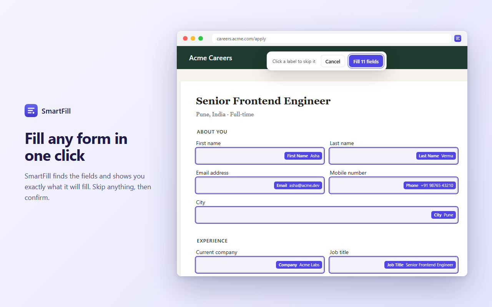

<div align="center">


# SmartFill

**Fill web forms in one click, accurately and privately.**

A free, open-source browser extension for Chrome and Firefox that fills sign-up, checkout and job-application forms from profiles you save. Your data never leaves your browser.

[](https://github.com/Himanshuch8055/SmartFill/actions/workflows/ci.yml)
[](LICENSE)
[](CONTRIBUTING.md)

[Features](#features) · [Install](#install) · [Development](#development) · [Contributing](CONTRIBUTING.md) · [Privacy](#privacy)

</div>

<p align="center"></p>

---

## Features

- **Accurate detection.** Scores each field using the browser's autocomplete hints, labels, names and placeholders, so "First name" never gets your full name and "Hotel name" is left alone.
- **Preview and undo.** See exactly what will be filled before it happens, and undo any fill with one click.
- **Every field type.** Text, dropdowns (matches "UK" to United Kingdom), radio buttons, checkboxes, date pickers, and phone fields with length limits. Fills billing and shipping sections together.
- **Works on modern sites.** React, Vue and Angular forms, and Google Forms.
- **Learns your sites.** Correct a field once and SmartFill offers to remember it for that website.
- **Multiple profiles.** Personal, Work, Job hunting… switch with a shortcut, or set a default profile per site.
- **Built for job applications.** LinkedIn, GitHub, portfolio, experience, notice period, salary and a short bio.
- **Keyboard and right-click.** `Alt+Shift+F` fill · `Alt+Shift+Z` undo · `Alt+Shift+P` switch profile · right-click any field → *Fill this field with…*
- **Private by design.** No account, no server, no tracking. Never touches password, card, OTP or ID-number fields.

## Install

| Browser | Link |
|---|---|
| Chrome / Edge / Brave | Chrome Web Store: *coming soon* |
| Firefox | Firefox Add-ons: *coming soon* |

**From source (any Chromium browser):**

```bash
git clone https://github.com/Himanshuch8055/SmartFill.git
cd SmartFill/extension
npm ci
npm run build
```

Then open `chrome://extensions`, enable **Developer mode**, click **Load unpacked** and choose `extension/dist`.
For Firefox, run `npm run build:firefox` and load `extension/dist-firefox/manifest.json` from `about:debugging` → *This Firefox* → *Load Temporary Add-on*.

Prebuilt zips for every commit on `main` are attached to the [CI runs](https://github.com/Himanshuch8055/SmartFill/actions/workflows/ci.yml), and tagged versions are on the [Releases](https://github.com/Himanshuch8055/SmartFill/releases) page.

## Repository layout

| Folder | What it is | Status |
|---|---|---|
| [`extension/`](extension) | The browser extension (Manifest V3, React, Vite, Tailwind) | **Main product** |
| [`website/`](website) | Marketing site and privacy policy (React, Vite, Tailwind) | Active |
| [`server/`](server) | Express + MongoDB scaffold for a possible future sync service | Experimental, not used by the extension |

## Development

Requirements: **Node.js 20+** and npm.

```bash
cd extension
npm ci
npm run dev        # dev build with hot reload (load extension/dist as unpacked)
npm test           # unit + fixture tests (Vitest + jsdom)
npm run package    # store zips for Chrome, Firefox and source → extension/release/
```

How it fits together:

```
popup / options / welcome (React)          content script (every page)
            │  chrome.runtime messages              │  detect → preview → fill → undo
            ▼                                        ▼
      background service worker  ◀────────────▶  lib/detectFields.js  (scoring + filling)
            │                                     lib/selector.js     (site-rule selectors)
            ▼
      chrome.storage.local  (profiles, rules, settings: never leaves the device)
```

Adding support for a site that fills incorrectly usually means adding a fixture: drop an HTML file into [`extension/test/fixtures/`](extension/test/fixtures) with `data-expect="<field>"` on each input, run `npm test`, and adjust the patterns in [`detectFields.js`](extension/src/lib/detectFields.js). See [CONTRIBUTING.md](CONTRIBUTING.md).

## Privacy

SmartFill stores everything in your browser's local extension storage. It has no backend, no analytics and no remote code. Read the full [privacy policy](website/src/pages/Privacy.jsx).

## Contributing

Bug reports, site-compatibility reports and pull requests are welcome. Please read [CONTRIBUTING.md](CONTRIBUTING.md) and our [Code of Conduct](CODE_OF_CONDUCT.md). To report a security issue, see [SECURITY.md](SECURITY.md) (please don't open a public issue for it).

## License

[MIT](LICENSE) © Himanshu Chauhan
